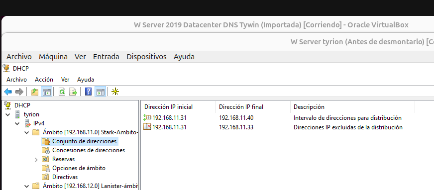
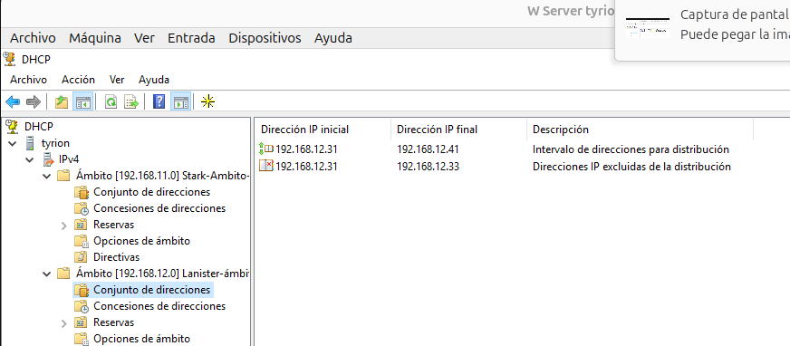
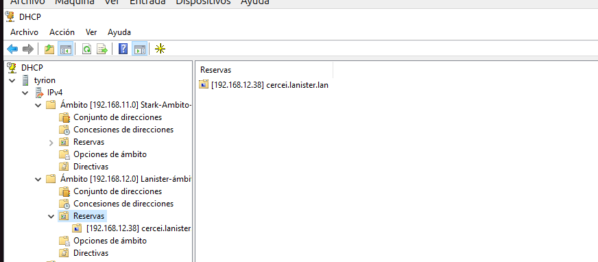
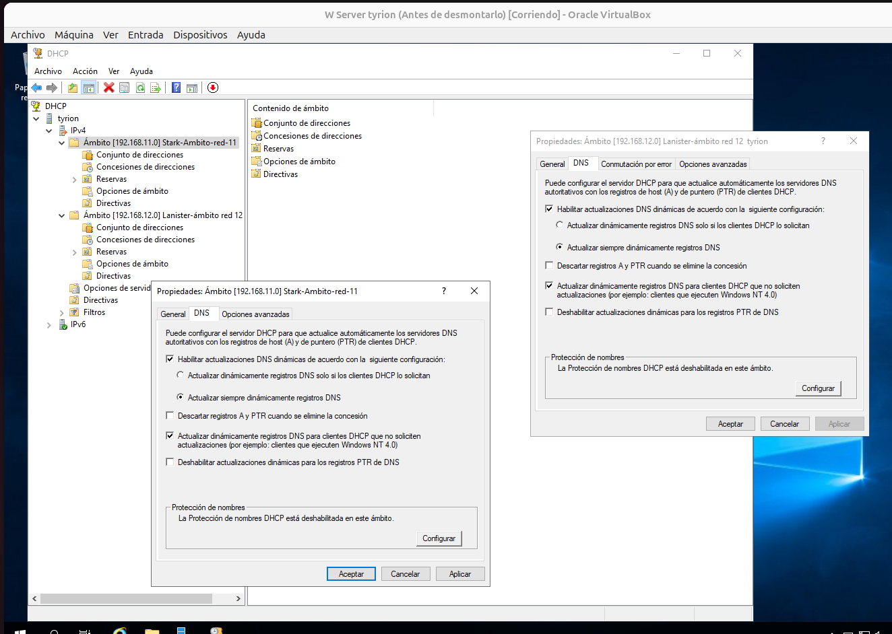
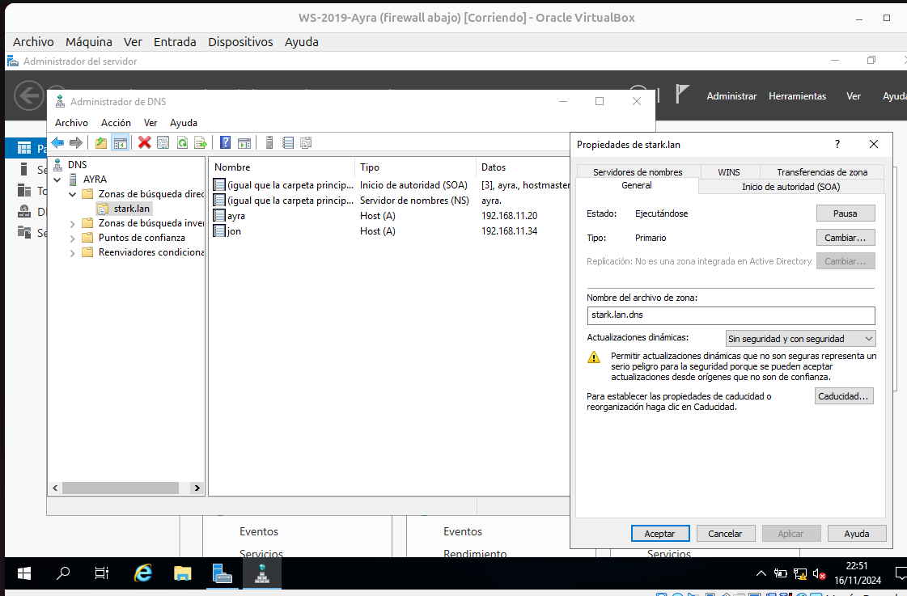
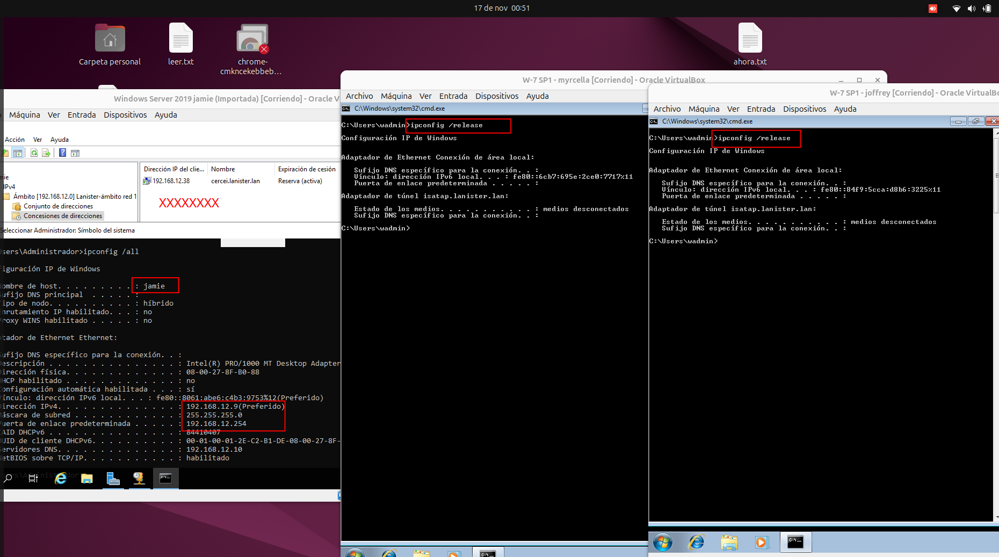
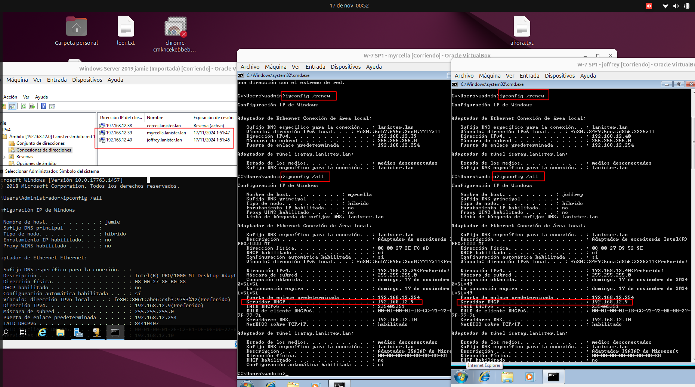

## 0- Como todas las tareas se entregaron a las 23:59 no me dí cuenta que esta acababa por la mañana, por eso la entrego tarde.

### 1- Configuración dos ambitos e rangos de enderezos

- Rango de direcciones:

Ámbito red 192.168.11.0 - stark.lan

 
 Ámbito red 192.168.12.0 - lanister.lan  
   

- Reserva en ámbito 192.168.12.0 lanister.lan (cercei)

### 2- Configuración de opcións

Opciones red 11 stark

Opciones red 12 lanister

### 3- Configuración da actualización

Actualizaciones dns en ambos ámbitos DHCP (servidor tyrion, 2 interfaces y ámbitos)

Actualización DNS en el servidor tiwin red 12 - lanister

Actualización DNS en el servidor ayra reg 11 - stark

### 4- Vídeo no que o cliente renova a concesión, e se ve **a zona DNS** unha vez que o DHCP actualiza o DNS. **Tamén o cliente debe ser capaz de resolver o seu propio nome (non FQDN).**

## [Enlace al vídeo de la renovación DHCP](https://youtu.be/-kqL-wYzICA)

### 5- Clientes das dúas subredes, amosando DNS, router e enderezo IP.

### 6- Configuración dos servidores failover.

### 7-Capturas dos clientes obtendo enderezos cos dous servidores failover encendidos, e con un acendido e outro apagado (de forma alterna)

