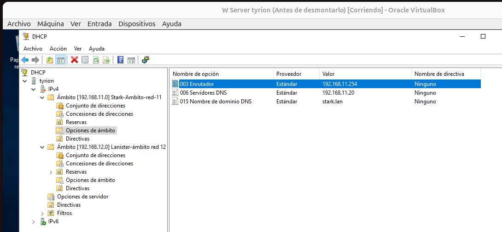
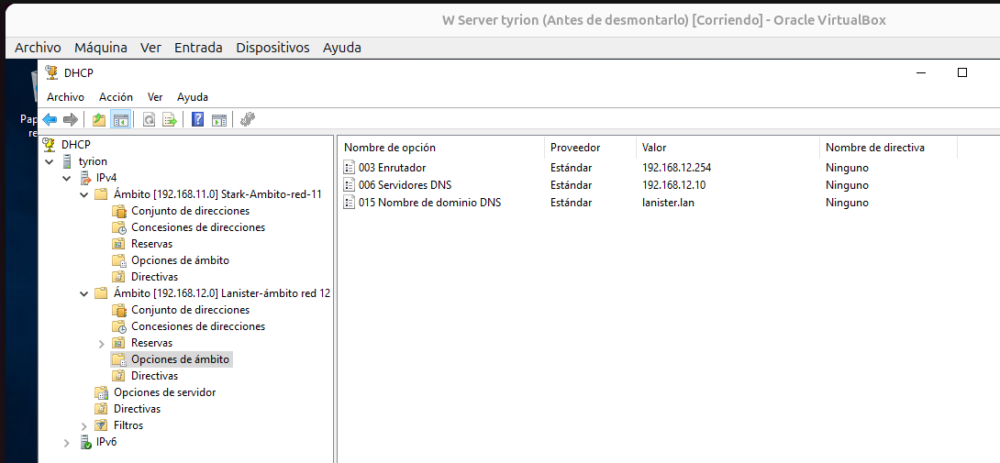
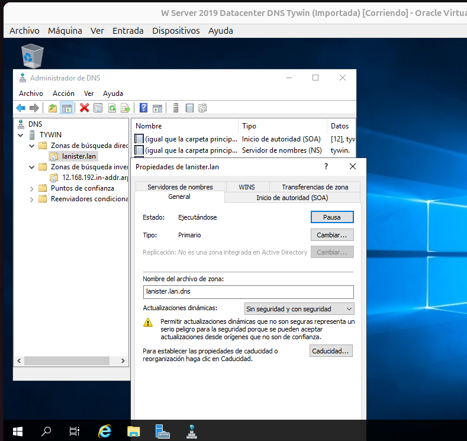
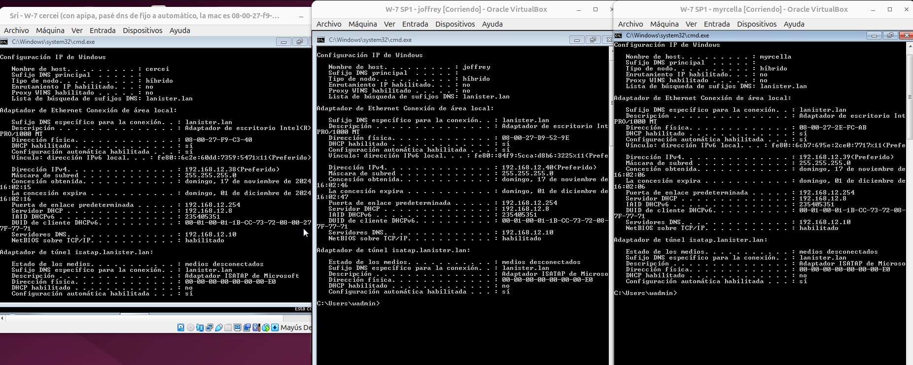
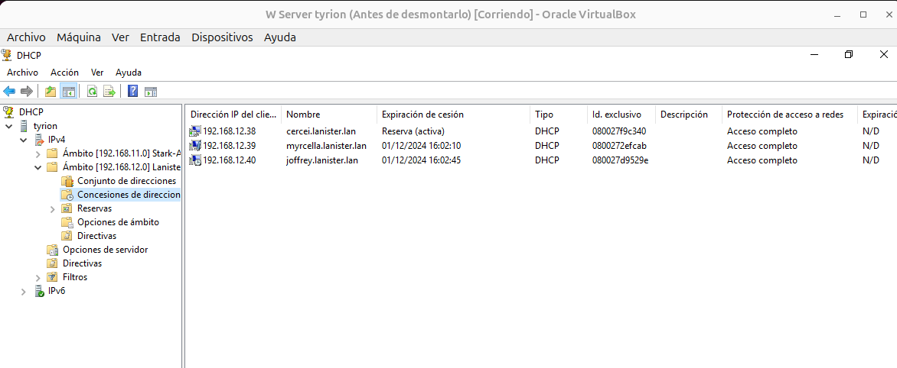
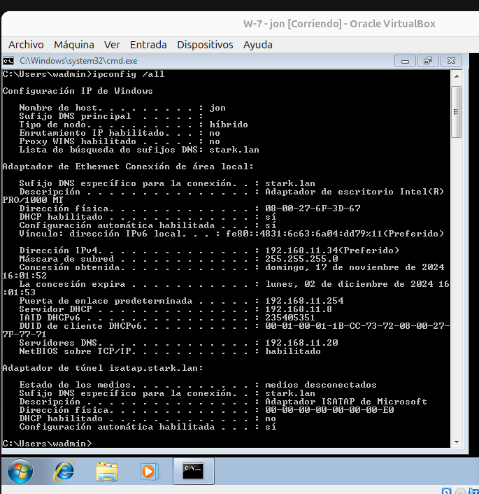
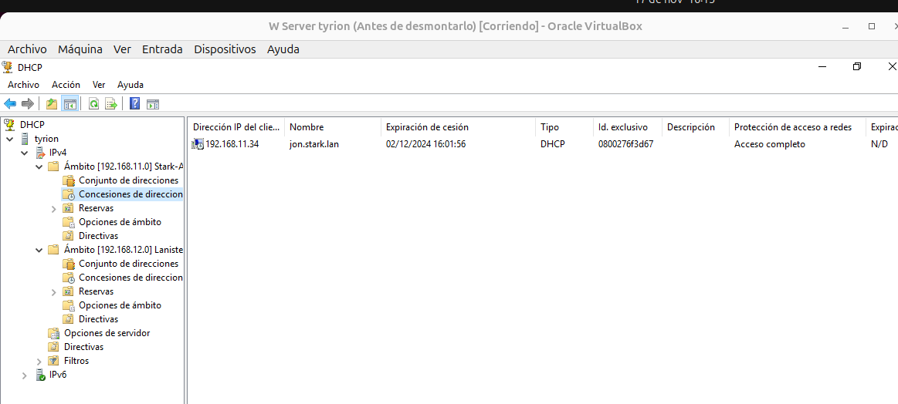

## 0- Como todas las tareas se entregaron a las 23:59 no me dí cuenta que esta acababa por la mañana, por eso la entrego tarde.

## 1- Configuración dos ambitos e rangos de enderezos

- Rango de direcciones:

Ámbito red 192.168.11.0 - stark.lan

 
 Ámbito red 192.168.12.0 - lanister.lan  
   

- Reserva en ámbito 192.168.12.0 lanister.lan (cercei)

## 2- Configuración de opcións

Opciones red 11 stark

Opciones red 12 lanister

## 3- Configuración da actualización

Actualizaciones dns en ambos ámbitos DHCP (servidor tyrion, 2 interfaces y ámbitos)

Actualización DNS en el servidor tiwin red 12 - lanister

Actualización DNS en el servidor ayra reg 11 - stark

## 4- Vídeo no que o cliente renova a concesión, e se ve a zona DNS unha vez que o DHCP actualiza o DNS. Tamén o cliente debe ser capaz de resolver o seu propio nome (non FQDN).

- Vídeo de la renovación DNS y resolución propio nombre (no FQDN)

## [Enlace al vídeo](https://youtu.be/fzB_co86qUQ)

## 5- Clientes das dúas subredes, amosando DNS, router e enderezo IP.

- **Subred lanister.lan - 192.168.12.0**

Clientes

- Servidor DHCP

- **Subred stark.lan - 192.168.11.0**

Clientes

- Servidor DHCP

## 6- Configuración dos servidores failover.

## 7-Capturas dos clientes obtendo enderezos cos dous servidores failover encendidos, e con un acendido e outro apagado (de forma alterna)

## Elimina a interface de rede 192.168.11.8 de tyrion, e configura o servizo DHCP Relay no router. Comproba que os equipos da rede stark.lan reciben a configuración de rede de xeito correcto. Inclúe as capturas necesarias.

